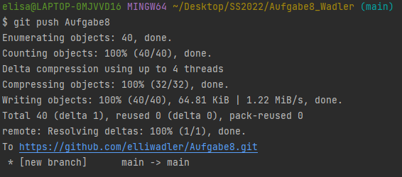

#README - Aufgabe8

##Tabellen
###User
Alle Userarten werden zusammen in einer Tabelle gespeichert. Da sich sich nur durch sehr wenige Attribute unterscheiden und beinahe ident sich schien es mir nicht sehr sinnvoll für jede Userart eine eigene Tabelle zu imlementieren.
Zur Unterschiedung der einzelnen Rolen gibt es das Attribut "role".
- 1 - ADMIN
- 2 - ASSISTENT
- 3 - STUDENT

Beim Student wird das Attribut "level" benötigt um zu speichern welche Projektberechtigungen er hat. Für den Admin und den Assistenten wurden 3 weitere Spalten hinzugefügt um festzuhalten wie viele Projekte er verwalten möchte.
Es gibt zur Erstellung des Studenten und zur Erstellung des Admin/Assistenten eigene Konstruktoren.
###Project
Alle Projektarten werden zusammen in eine Tabelle gespeichert. Zur Unterscheidung existiert das Attribut "type".
- 1 - Projekt
- 2 - Bachelorarbeit
- 3 - Masterarbeit

###Beziehungen
Zwischen Admin/Assistent und Projekt besteht eine One-to-Many Beziehung. 
Zwischen Student und Projekt eine One-to-One Beziehung, da ein Student nur ein Projekt gleichzeitig haben darf.

##Student Logik
Wenn man sich als Student einloggt kommt man auf die "WelcomeStudent"-page. Dort sieht man das aktuelle Projekt (falls vorhanden). Klick man auf Find new Projekt, kann man eine Projekt hinzufügen falls keines vorhanden ist, sonst wird der Button, zum Hinzufügen, entfernt. Es werden immer nur die Projekte angezeigt für die der Student die passenden Berechtigungen hat. Wird ein Projekt abgeschlossen erhöht sich das Level des Students. 

###Git
